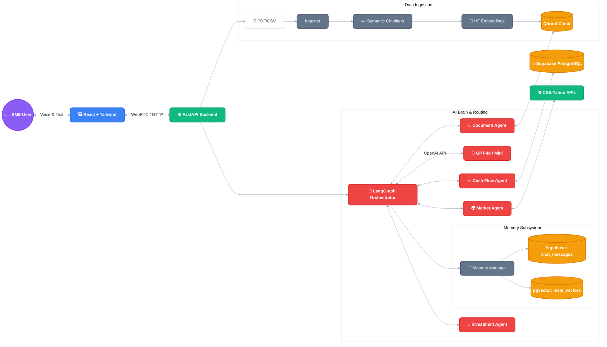
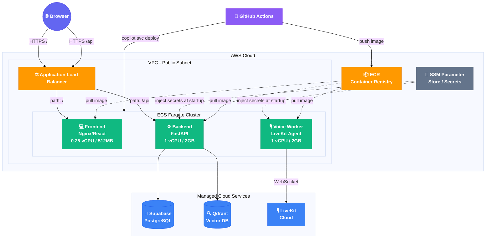
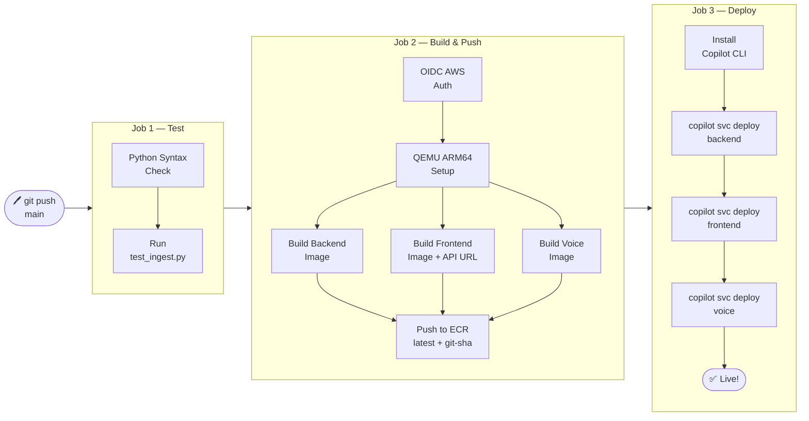

# FinVox: AI-Powered SME Financial Advisory System 🎙️📊

**FinVox** is a Conversational Voice & Chat Multi-Agent Platform designed specifically for Small and Medium Enterprises (SMEs) in Sri Lanka. It acts as an intelligent, real-time financial consultant, allowing SME owners to manage cash flow, analyze investments, and make data-driven decisions using natural voice or text interactions.

## 🚀 Key Features

- **Voice & Chat Interface:** Communicate naturally via text or voice (powered by **LiveKit WebRTC**, **Deepgram STT**, **ElevenLabs TTS**, and **Silero VAD** for rapid voice-activity detection). Built with support for code-mixed Sri Lankan English.
- **Multi-Agent AI Core (Fan-Out Architecture):** Powered by a custom **LangGraph** state machine supporting parallel execution for compound queries:
  - 🧠 *Router Node:* Analyzes user intent, splits compound queries into multiple routes, and injects memory context.
  - ⚙️ *Parallel Sub-Agents & Custom Tools:* Executes specialized agents simultaneously based on routing decisions, armed with custom LangChain tools:
    - 📄 *Document RAG Agent:* Analyzes internal knowledge and extracts data from uploaded documents.
    - 📈 *Cash Flow Agent:* Uses the `SQL Generator` and `Chart Generator` tools to dynamically analyze and visualize past/present cash flow.
    - 🌍 *Market Agent:* Fetches real-time Sri Lankan stock market data via the custom `CSE API Tool`.
    - 💼 *Investment Agent:* Provides targeted financial advice using the `Financial Calculator` tool.
    - 🔌 *MCP Integration:* Seamlessly integrates with external third-party tools via the `Model Context Protocol (FastMCP)`.
  - 🔄 *Merge Responses (Fan-In):* Automatically synthesizes parallel agent outputs into a single, cohesive user response.
- **Data Intelligence & Data Privacy (RAG + Text-to-SQL):** Securely processes uploaded financial documents using advanced architectures:
  - **Dynamic SQL Tables (Text-to-SQL):** Automatically converts structured tabular data (CSV/Excel) into native dynamic PostgreSQL tables in Supabase via the `table_manager`.
  - **Privacy-First Embeddings:** Uses 100% local, free Sentence Transformers (`BAAI/bge-large-en-v1.5`) so sensitive SME financial data never leaves the network.
  - **Advanced Chunking Strategies:** Employs *Parent-Child Chunking* for Markdown PDFs and *JSON Row-Level Chunking* for unstructured extraction via `ingest_service`.
  - **Vector Storage:** Anchored by Qdrant Cloud for ultra-fast cosine similarity search.
  - **CAG (Cache-Augmented Generation):** Implements a zero-latency semantic cache using Qdrant to instantly serve highly similar queries, significantly reducing latency and LLM API costs.
  - **CRAG (Corrective RAG):** Employs confidence-gated self-correction using a fast extractor model to fetch better context before generating the answer.
- **Advanced Memory Subsystem (Background Processed):** Equips the AI with human-like memory capabilities, processed entirely asynchronously via **ARQ + Redis** background workers to ensure zero latency for the user:
  - **Short-Term Memory (Working Memory):** High-speed ring buffer maintaining immediate conversation context.
  - **Long-Term Memory (Factual Recall):** Extracts and persists core user facts into Supabase `pgvector` using a hyper-efficient Vector-First Overwrite logic.
  - **Episodic Memory (Session Summaries):** Distills complete conversations into semantic episodes with automatic time-decay (TTL).
- **Business Intelligence & Analytics UI:**
  - **KPI Management:** Custom interface to create, track, and evaluate financial KPIs using dynamic SQL formulas.
  - **Power BI Integration:** A dedicated full-screen Visualization module for embedding Power BI "Publish to Web" dashboards seamlessly within the FinVox platform.

---

## 🏗️ Application Architecture

---

## ☁️ AWS Cloud Architecture

All services run on **AWS ECS Fargate** (ARM64 / Graviton) with zero server management. Secrets are injected at runtime via AWS SSM. The CI/CD pipeline is fully automated via GitHub Actions.

---

## 🔄 CI/CD Pipeline

Every push to `main` triggers a fully automated 3-stage pipeline:

---

## 🚢 Deployment Guide

Full step-by-step deployment instructions are in [`docs/deployment_guide.md`](docs/deployment_guide.md).

**Quick summary:**

1. **One-time setup:** Run `copilot app init finvox` + `copilot env init --name dev`
2. **Add secrets** to AWS SSM (`/finvox/dev/OPENAI_API_KEY` etc.)
3. **Deploy backend first** → get the ALB URL
4. **Update** `VITE_API_BASE_URL` in `copilot/frontend/manifest.yml` with `<ALB_URL>/api`
5. **Deploy frontend & voice** → everything is live!
6. **All future deploys:** just `git push` to `main` — GitHub Actions handles the rest automatically.

---

## 🛠️ Technology Stack

| Layer | Technology |
|---|---|
| **Frontend UI** | React 19 + TypeScript + Tailwind CSS (Vite) |
| **Frontend Libraries** | Recharts (Analytics), React Markdown/KaTeX (Math), LiveKit React |
| **Backend API** | FastAPI (Python 3.11) + Uvicorn + Server-Sent Events (SSE) |
| **Voice Pipeline** | LiveKit Agents + Deepgram STT + ElevenLabs TTS + Silero VAD |
| **AI Framework** | LangChain & LangGraph (Multi-Agent Orchestration) |
| **LLM & Search** | OpenAI GPT-4o / GPT-4o-mini, Tavily (Web Search), Yahoo Finance |
| **Tool Integration** | Model Context Protocol (MCP) via FastMCP |
| **Embeddings** | HuggingFace `BAAI/bge-large-en-v1.5` (100% local) |
| **Vector DB / Cache** | Qdrant Cloud (Semantic Cache-Augmented Generation) |
| **State & Memory DB** | Supabase (PostgreSQL + pgvector) |
| **Background Workers** | ARQ + Redis (Async memory distillation & task processing) |
| **Observability** | LangFuse (Tracing, prompt versioning, cost tracking) |
| **Cloud Compute** | AWS ECS Fargate (ARM64 / Graviton) |
| **Cloud Storage/Secrets**| Amazon ECR & AWS SSM Parameter Store |
| **CI/CD & Deploy** | GitHub Actions (OIDC) + AWS Copilot CLI |
| **Networking** | AWS ALB + VPC Public Subnets (NAT Gateway bypassed) |

---

## 🔮 Future Enhancements

- **On-the-Fly API Fetching (Real-time Tool Calling):** Direct integration with external accounting and BI software (e.g., QuickBooks, Xero, Power BI) via REST APIs. Instead of storing large datasets natively, FinVox will utilize dynamic AI tool calling to fetch live financial reports and ledger data directly from these third-party APIs upon user request. This eliminates data duplication, reduces storage costs, and guarantees 100% real-time data accuracy.

## 🎓 Academic Context

This project is developed by **Dinod Imanjith Withanawasam** (Student ID: KD/BSCSD/21/28 | Cardiff Met ID: st20312099) as part of the BSc (Hons) in Software Engineering program.

---

*Empowering Sri Lankan SMEs with accessible, real-time decision intelligence.*
