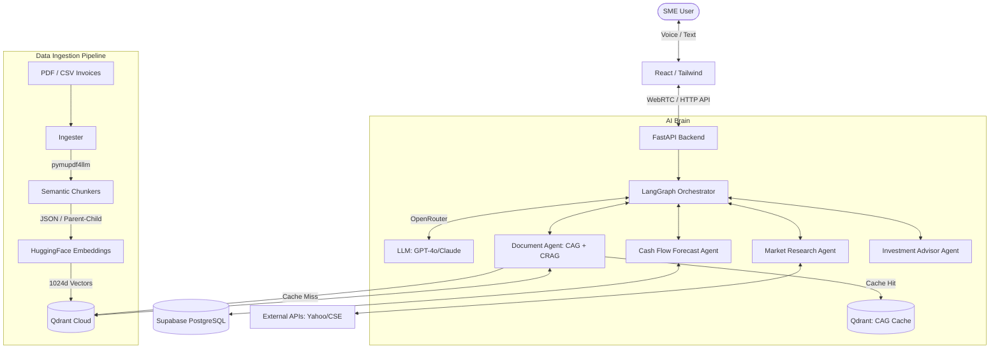

# FinVox: AI-Powered SME Financial Advisory System 🎙️📊

**FinVox** is a Conversational Voice & Chat Multi-Agent Platform designed specifically for Small and Medium Enterprises (SMEs) in Sri Lanka. It acts as an intelligent, real-time financial consultant, allowing SME owners to manage cash flow, analyze investments, and make data-driven decisions using natural voice or text interactions.

## 🚀 Key Features

- **Voice & Chat Interface:** Communicate naturally via text or voice (powered by OpenAI Whisper / Deepgram STT and ElevenLabs TTS). Built with support for code-mixed Sri Lankan English.
- **Multi-Agent AI Core:** Powered by LangGraph, coordinating specialized AI agents:
  - 🧠 *Orchestrator Agent:* Routes queries to the appropriate specialist.
  - 📄 *Document Parser Agent:* Extracts structured data from CSV, Excel, and PDF invoices. (Utilizes `pymupdf4llm` for highly accurate, zero-latency Markdown table extraction from borderless PDFs without relying on LLMs).
  - 📈 *Cash Flow Forecast Agent:* Predicts 30/60/90-day liquidity and cash flow.
  - 🌍 *Market Research Agent:* Fetches real-time market data (Yahoo Finance, CSE, CBSL).
  - 💼 *Investment Advisor Agent:* Recommends allocations for surplus capital.
  - 📑 *Report Generator Agent:* Creates downloadable PDF financial health summaries.
- **Data Intelligence & Data Privacy (RAG):** Securely processes uploaded financial documents using an advanced RAG pipeline:
  - **Privacy-First Embeddings:** Uses 100% local, free Sentence Transformers (`BAAI/bge-large-en-v1.5`) so sensitive SME financial data never leaves the network for embedding generation.
  - **Advanced Chunking Strategies:** Employs *Parent-Child Chunking* for Markdown PDFs (preserving semantic hierarchies) and *JSON Row-Level Chunking* for CSVs and tabular data to ensure zero data loss.
  - **Vector Storage:** Anchored by Qdrant Cloud for ultra-fast cosine similarity search.
  - **CAG (Cache-Augmented Generation):** Implements a zero-latency semantic cache using Qdrant to store and instantly serve identical or highly similar queries, significantly reducing latency and LLM API costs.
  - **CRAG (Corrective RAG):** Employs confidence-gated self-correction using a fast extractor model. If initial retrieved documents lack context, it automatically restructures the query and fetches better context before generating the answer.
## 🏗️ System Architecture

    
## 🛠️ Technology Stack

- **Frontend:** React.js + Tailwind CSS
- **Backend:** FastAPI (Python)
- **AI Framework:** LangChain & LangGraph
- **Vector Database:** Qdrant Cloud
- **State Database:** Supabase (PostgreSQL)
- **LLM Routing:** OpenRouter (OpenAI, Anthropic, Groq)
- **Embeddings:** HuggingFace Sentence Transformers (`bge-large-en-v1.5`)
- **Voice Pipeline:** LiveKit, Deepgram, ElevenLabs

## 🎓 Academic Context

This project is developed by **Dinod Imanjith Withanawasam** (Student ID: KD/BSCSD/21/28 | Cardiff Met ID: st20312099) as part of the BSc (Hons) in Software Engineering program.

---
*Empowering Sri Lankan SMEs with accessible, real-time decision intelligence.*
