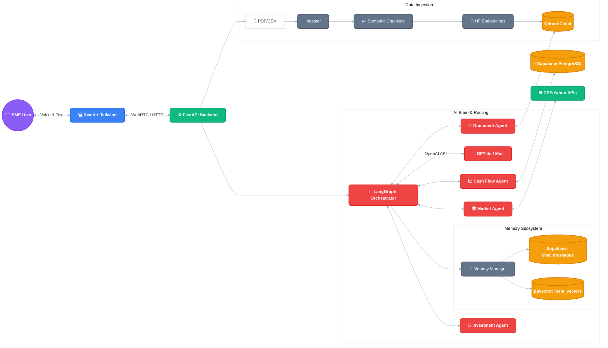

# FinVox: AI-Powered SME Financial Advisory System 🎙️📊

**FinVox** is a Conversational Voice & Chat Multi-Agent Platform designed specifically for Small and Medium Enterprises (SMEs) in Sri Lanka. It acts as an intelligent, real-time financial consultant, allowing SME owners to manage cash flow, analyze investments, and make data-driven decisions using natural voice or text interactions.

## 🚀 Key Features

- **Voice & Chat Interface:** Communicate naturally via text or voice (powered by OpenAI Whisper / Deepgram STT and ElevenLabs TTS). Built with support for code-mixed Sri Lankan English.
- **Multi-Agent AI Core (Fan-Out Architecture):** Powered by a custom LangGraph state machine supporting parallel execution for compound queries:
  - 🧠 *Router Node:* Analyzes user intent, splits compound queries into multiple routes, and injects memory context.
  - ⚙️ *Parallel Sub-Agents:* Executes specialized agents simultaneously based on routing decisions:
    - 📄 *Document RAG Agent:* Analyzes internal knowledge and extracts data from uploaded documents.
    - 📈 *Cash Flow Agent:* Analyzes past and present cashflow using dynamic SQL queries.
    - 🌍 *Market Agent:* Fetches real-time stock market data (e.g., CSE) via API.
    - 💼 *Investment Agent:* Provides targeted financial advice for surplus capital.
    - 💬 *General Agent:* Handles natural conversation and fallback queries.
  - 🔄 *Merge Responses (Fan-In):* Automatically synthesizes parallel agent outputs into a single, cohesive user response.
- **Data Intelligence & Data Privacy (RAG + Text-to-SQL):** Securely processes uploaded financial documents using advanced architectures:
  - **Dynamic SQL Tables (Text-to-SQL):** Automatically converts structured tabular data (CSV/Excel) into native dynamic PostgreSQL tables in Supabase. By passing vector similarity entirely, this enables the AI to execute 100% accurate native SQL queries on user-uploaded data.
  - **Privacy-First Embeddings:** Uses 100% local, free Sentence Transformers (`BAAI/bge-large-en-v1.5`) so sensitive SME financial data never leaves the network for embedding generation.
  - **Advanced Chunking Strategies:** Employs *Parent-Child Chunking* for Markdown PDFs (preserving semantic hierarchies) and *JSON Row-Level Chunking* for unstructured extraction.
  - **Vector Storage:** Anchored by Qdrant Cloud for ultra-fast cosine similarity search for PDF reports.
  - **CAG (Cache-Augmented Generation):** Implements a zero-latency semantic cache using Qdrant to store and instantly serve identical or highly similar queries, significantly reducing latency and LLM API costs.
  - **CRAG (Corrective RAG):** Employs confidence-gated self-correction using a fast extractor model. If initial retrieved documents lack context, it automatically restructures the query and fetches better context before generating the answer.
- **Advanced Memory Subsystem:** Equips the AI with human-like memory capabilities:
  - **Short-Term Memory (Working Memory):** High-speed ring buffer maintaining immediate conversation context (last 30 turns).
  - **Long-Term Memory (Factual Recall):** Extracts and persists core user facts seamlessly into Supabase `pgvector` using a hyper-efficient Vector-First Overwrite logic (0 LLM overhead for updates).
  - **Episodic Memory (Session Summaries):** Distills complete conversations into semantic episodes with automatic time-decay (TTL).
- **Business Intelligence & Analytics UI:**
  - **KPI Management:** Custom interface to create, track, and evaluate financial KPIs using dynamic SQL formulas.
  - **Power BI Integration:** A dedicated full-screen Visualization module for embedding Power BI "Publish to Web" dashboards seamlessly within the FinVox platform. Includes a built-in guide for PDF exporting bypassing CORS limitations.
## 🏗️ System Architecture

## 🛠️ Technology Stack

- **Frontend:** React.js + Tailwind CSS
- **Backend:** FastAPI (Python)
- **AI Framework:** LangChain & LangGraph
- **Vector Database:** Qdrant Cloud
- **State Database:** Supabase (PostgreSQL)
- **LLM Routing:** OpenAI (GPT-4o, GPT-4o-mini)
- **Embeddings:** HuggingFace Sentence Transformers (`bge-large-en-v1.5`)
- **Voice Pipeline:** LiveKit, Deepgram, ElevenLabs

## 🔮 Future Enhancements

- **On-the-Fly API Fetching (Real-time Tool Calling):** Direct integration with external accounting and BI software (e.g., QuickBooks, Xero, Power BI) via REST APIs. Instead of storing large datasets natively, FinVox will utilize dynamic AI tool calling to fetch live financial reports and ledger data directly from these third-party APIs upon user request. This eliminates data duplication, reduces storage costs, and guarantees 100% real-time data accuracy.

## 🎓 Academic Context

This project is developed by **Dinod Imanjith Withanawasam** (Student ID: KD/BSCSD/21/28 | Cardiff Met ID: st20312099) as part of the BSc (Hons) in Software Engineering program.

---

*Empowering Sri Lankan SMEs with accessible, real-time decision intelligence.*
